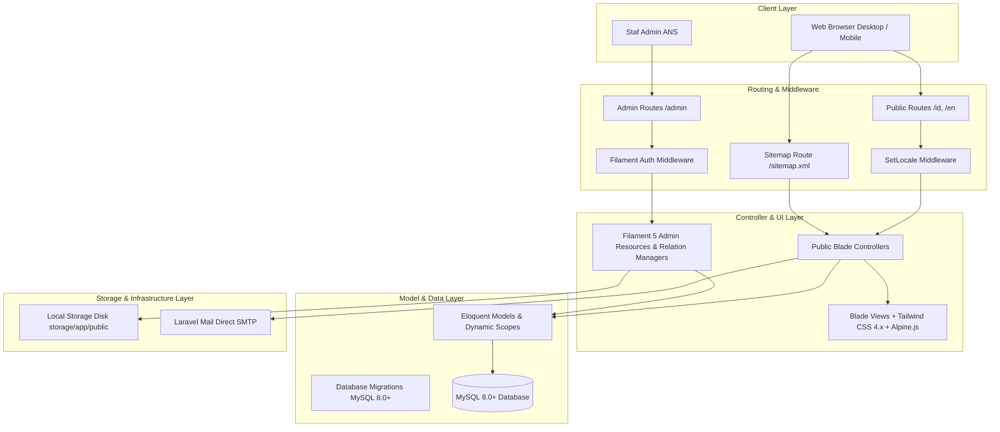
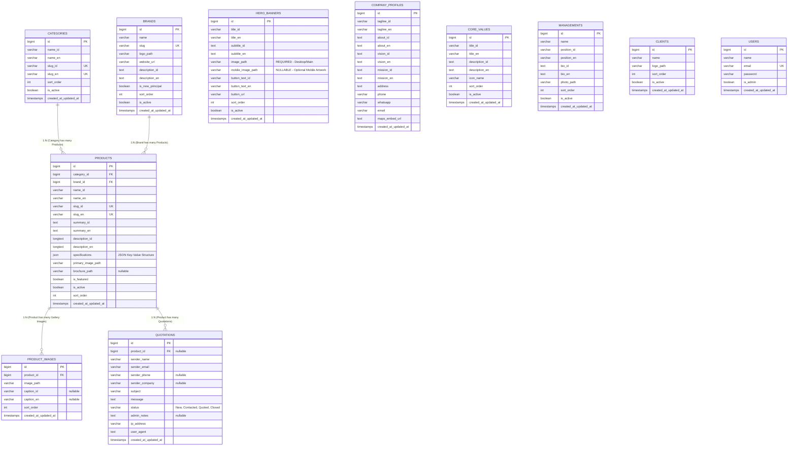
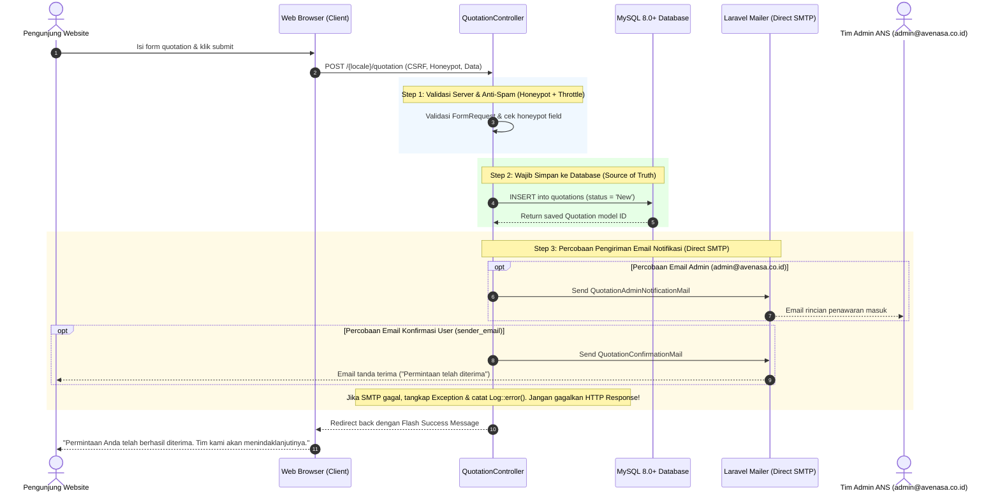
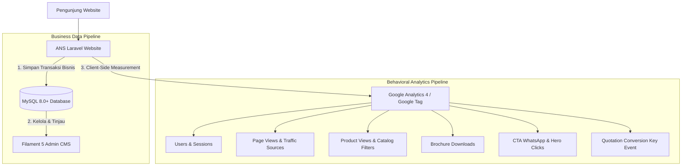

# System Design

**Proyek:** Website Company Profile & Katalog Produk  
**Klien:** PT Abhipraya Nawasena Sejahtera (ANS)  
**Dokumen Referensi & Prioritas Sumber:**
1. [docs/architecture/technology-baseline.md](file:///c:/laragon/www/avenasa/docs/architecture/technology-baseline.md) *(Sumber Kebenaran Utama Teknologi)*
2. [docs/urs/ans-website-urs.md](file:///c:/laragon/www/avenasa/docs/urs/ans-website-urs.md)
3. Requirements Discovery Report & Business & Content Discovery Report
4. [docs/references/Company Profile ANS 2026 Rev.02.pdf](file:///c:/laragon/www/avenasa/docs/references/Company%20Profile%20ANS%202026%20Rev.02.pdf)  
**Status Tahap:** Baseline System Architecture & Technical Design (Revisi Final Terkunci)

---

## 1. Architectural Goals

Arsitektur sistem website PT Abhipraya Nawasena Sejahtera (ANS) dirancang untuk mencapai lima tujuan utama:

1. **Shared-Hosting Compatibility:** Sistem beroperasi secara andal, cepat, dan mandiri pada lingkungan shared hosting / cPanel standar (PHP 8.3.x, Apache/LiteSpeed, MySQL 8.0+, local filesystem storage, dan direct SMTP) tanpa dependensi pada background process daemon (Redis, Horizon, Supervisor) maupun runtime container production.
2. **Structured CMS, Not Page Builder:** CMS dirancang murni untuk mengelola entitas bisnis nyata (Katalog Produk, Dokumen Teknis, Konten Profil Perusahaan, Leads Penawaran), bukan generic page/section builder atau arbitrary drag-and-drop builder yang rentan merusak layout dan konsistensi data.
3. **SEO-First Multilingual Experience:** Struktur routing dan penyajian konten dirancang untuk memaksimalkan pengindeksan mesin pencari (SEO) pada pasar Indonesia (`/id/`) dan Internasional (`/en/`) menggunakan semantic localized slug, canonical tags, hreflang tags, dan satu file sitemap XML terpadu (`/sitemap.xml`).
4. **Mobile-First Responsiveness:** Seluruh antarmuka publik dan pola interaksinya (khususnya drawer filter produk, hero carousel, tabel spesifikasi teknis, dan CTA quotation) dibangun dengan pendekatan mobile-first menggunakan Tailwind CSS 4.x.
5. **High-Integrity Lead Generation:** Database bertindak sebagai *single source of truth*. Setiap permintaan penawaran harga (*quotation*) dari calon klien B2B wajib tersimpan aman di database sebelum pengiriman email notifikasi dicoba, memastikan data prospek tidak pernah hilang meskipun koneksi mail server hosting mengalami gangguan.

---

## 2. Technical Baseline (Terkunci Sesuai Technology Baseline)

| Komponen | Pilihan Teknologi / Pendekatan | Rationale & Catatan |
|---|---|---|
| **Runtime / Language** | PHP 8.3.x (Local target: 8.3.30) | Lingkungan runtime modern, cepat, dan stabil. |
| **Backend Framework** | Laravel 12.x | Framework standar industri yang tangguh dan aman. |
| **Admin CMS Framework** | Filament 5.x (STRICT POLICY: v5.x ONLY) | Panel admin modern berbasis TALL stack generasi terbaru. |
| **Fullstack Component** | Livewire 4.x | Dependency inti penggerak reaktivitas Filament 5. |
| **Frontend Templating** | Laravel Blade | Server-rendered murni yang cepat dan ramah SEO. |
| **Frontend Styling** | Tailwind CSS 4.x | Styling utilitas modern dengan performa kompilasi tinggi via Vite. |
| **Micro-interactivity** | Alpine.js (minimal) | Menangani interaktivitas UI ringan (modal drawer, toggle mobile menu, slider). |
| **Database Engine** | MySQL 8.0+ (InnoDB, UTF8mb4) | Mendukung tipe data native JSON untuk spesifikasi produk dinamis. |
| **Penyimpanan Media** | Laravel Local Public Filesystem (`storage/app/public`) | Symlink `public/storage`, mandiri tanpa biaya cloud storage (S3). |
| **Protokol Email** | Laravel Mailer via Direct SMTP | Direct synchronous delivery dengan penanganan fail-safe database persistence. |
| **Dev Tooling (AI)** | Laravel Boost | Perkakas bantu AI lokal (development-only dependency, tidak ada di production). |
| **Testing Suite** | PHPUnit (Laravel Default Feature Tests) | Memvalidasi seluruh alur kritis aplikasi secara end-to-end. |

---

## 3. Application Architecture

Aplikasi dibangun di atas pola arsitektur MVC (Model-View-Controller) berlapis standar Laravel 12 yang ramping dan terstruktur:



### 3.1. Penjelasan Layer Aplikasi
1. **Routing Layer:**
   - `routes/web.php`: Menangani rute publik ber-prefix bahasa (`/{locale}/...`), rute sitemap tunggal (`/sitemap.xml`), dan pengalihan default root (`/` -> `/id`).
   - Rute Admin: Dikelola langsung oleh Filament 5 Panel Provider pada path `/admin`.
2. **Middleware Layer:**
   - `SetLocaleMiddleware`: Memeriksa segmen `{locale}`, memvalidasi (`id` atau `en`), mengeksekusi `app()->setLocale($locale)`, mengikat parameter route URL default, dan membagikan locale aktif ke seluruh Blade view.
   - `Authenticate` (Filament): Memproteksi dashboard admin.
3. **Controller Layer (Public):**
   - Standard HTTP Controllers: `HomeController`, `AboutController`, `ProductCatalogController`, `ProductDetailController`, `PartnerClientController`, `ContactController`, `QuotationController`, dan `SitemapController`.
   - Mengelola pemfilteran data via Eloquent Query Scope, validasi input FormRequest, dan mengembalikan Blade view server-rendered.
4. **Filament 5 Admin Layer:**
   - Filament Resources dan Relation Managers mengelola operasi CRUD, form validasi, repeater spesifikasi, relasi tabel terpisah, dan upload media secara deklaratif.
5. **Model Layer (Eloquent):**
   - Model Eloquent murni merepresentasikan tabel MySQL 8.0+, mendefinisikan relasi (*relationships*), accessors untuk bilingual field, dan casting JSON untuk spesifikasi dinamis.
6. **Mail Layer:**
   - Mailable classes (`QuotationAdminNotificationMail` dan `QuotationConfirmationMail`) menggunakan template Blade HTML responsif dengan konfigurasi SMTP berbasis environment variables.
7. **Storage Layer:**
   - Memanfaatkan disk lokal `public` Laravel yang terhubung ke direktori `public/storage` via symbolic link.

---

## 4. Domain Model

Domain model mencakup 11 entitas utama yang terdefinisi secara jelas (10 entitas bisnis/konten inti dan 1 entitas autentikasi admin):

### 4.1. Domain Katalog Produk (Catalog Management)
1. **Category (Kategori Produk)**
   - *Tujuan:* Mengelompokkan produk ke dalam lini portofolio utama (Microbiology, Food Safety, dsb.) secara flat (1 level).
   - *Field Utama:* `id`, `name_id`, `name_en`, `slug_id`, `slug_en`, `sort_order`, `is_active`, `created_at`, `updated_at`.
   - *Relasi:* `hasMany(Product::class)`.
   - *Status:* Wajib.
2. **Brand (Principal / Brand)**
   - *Tujuan:* Menyimpan data principal resmi/manufaktur produk (Merck, Neogen, Era Biology, dsb.) yang terhubung ke produk serta ditampilkan pada halaman showcase.
   - *Field Utama:* `id`, `name`, `slug`, `logo_path`, `website_url`, `description_id`, `description_en`, `is_new_principal` (boolean), `sort_order`, `is_active`, `created_at`, `updated_at`.
   - *Relasi:* `hasMany(Product::class)`.
   - *Status:* Wajib.
3. **Product (Produk)**
   - *Tujuan:* Entitas utama katalog produk laboratorium, diagnostik, dan consumables.
   - *Field Utama:* `id`, `category_id`, `brand_id`, `name_id`, `name_en`, `slug_id`, `slug_en`, `summary_id`, `summary_en`, `description_id`, `description_en`, `specifications` (JSON structure), `primary_image_path`, `brochure_path` (nullable), `is_featured`, `is_active`, `sort_order`, `created_at`, `updated_at`.
   - *Relasi:* `belongsTo(Category::class)`, `belongsTo(Brand::class)`, `hasMany(ProductImage::class)`, `hasMany(Quotation::class)`.
   - *Status:* Wajib.
4. **ProductImage (Galeri Foto Produk - Tabel Terpisah)**
   - *Tujuan:* Entitas/tabel terpisah untuk menyimpan foto-foto galeri tambahan per produk.
   - *Field Utama:* `id`, `product_id`, `image_path`, `caption_id` (nullable), `caption_en` (nullable), `sort_order`, `created_at`, `updated_at`.
   - *Relasi:* `belongsTo(Product::class)`.
   - *Status:* Opsional (1 Product memiliki 0 atau banyak ProductImage).

### 4.2. Domain Profil & Konten Perusahaan (Company Content)
5. **HeroBanner (Slider Beranda)**
   - *Tujuan:* Menampilkan visual bergerak dan penawaran lini produk unggulan di beranda.
   - *Field Utama:* `id`, `title_id`, `title_en`, `subtitle_id`, `subtitle_en`, `image_path` (REQUIRED - gambar utama/desktop), `mobile_image_path` (NULLABLE/OPTIONAL - artwork khusus mobile), `button_text_id`, `button_text_en`, `button_url`, `sort_order`, `is_active`, `created_at`, `updated_at`.
   - *Status:* Wajib.
6. **CompanyProfile (Profil Perusahaan & Kontak Resmi)**
   - *Tujuan:* Menyimpan data profil tunggal ANS (Sejarah, Visi, Misi, Slogan, Alamat Mensana Tower, Telepon, WhatsApp, Email, Peta Embed).
   - *Field Utama:* `id`, `tagline_id`, `tagline_en`, `about_id`, `about_en`, `vision_id`, `vision_en`, `mission_id`, `mission_en`, `address`, `phone`, `whatsapp`, `email`, `maps_embed_url`, `created_at`, `updated_at`.
   - *Status:* Wajib (Single Record / Singleton).
7. **CoreValue (6 Nilai Inti ANS)**
   - *Tujuan:* Menyimpan tepat 6 nilai inti spiral resmi ANS (Integrity, Innovation, Collaboration, Sustainability, Professionalism, Well-Being).
   - *Field Utama:* `id`, `title_id`, `title_en`, `description_id`, `description_en`, `icon_name`, `sort_order`, `is_active`, `created_at`, `updated_at`.
   - *Status:* Wajib (Tepat 6 item aktif).
8. **Management (Founder & Pimpinan)**
   - *Tujuan:* Menyimpan profil biografi 3 Founder/Owner (Erik Haryanto, Fernanda Ramadhan F, Hazin Yusuf).
   - *Field Utama:* `id`, `name`, `position_id`, `position_en`, `bio_id`, `bio_en`, `photo_path`, `sort_order`, `is_active`, `created_at`, `updated_at`.
   - *Status:* Wajib.
9. **Client (Klien Korporat)**
   - *Tujuan:* Menyimpan daftar logo pelanggan/klien korporat (Kalbe, Biofarma, Unilever, Prodia, dsb.) untuk customer showcase.
   - *Field Utama:* `id`, `name`, `logo_path`, `sort_order`, `is_active`, `created_at`, `updated_at`.
   - *Catatan Desain:* Tidak menambahkan field kategori/sektor yang tidak memiliki fungsi user-facing eksplisit pada UI.
   - *Status:* Wajib.

### 4.3. Domain Leads & Inquiry (Quotation Management)
10. **Quotation (Permintaan Penawaran Harga & Kontak)**
    - *Tujuan:* Mencatat seluruh inquiry penawaran dari formulir website sebagai database prospek.
    - *Field Utama:* `id`, `product_id` (nullable), `sender_name`, `sender_email`, `sender_phone` (nullable), `sender_company` (nullable), `subject`, `message`, `status` (Enum: `New`, `Contacted`, `Quoted`, `Closed`), `admin_notes` (nullable text), `ip_address`, `user_agent`, `created_at`, `updated_at`.
    - *Relasi:* `belongsTo(Product::class)`.
    - *Status:* Wajib.

### 4.4. Domain Autentikasi Admin
11. **User (Admin CMS)**
    - *Tujuan:* Autentikasi staf pengelola website di Filament 5.
    - *Field Utama:* `id`, `name`, `email`, `password`, `is_admin`, `created_at`, `updated_at`.
    - *Status:* Wajib.

---

## 5. Database Design & Entity Relationship Diagram (ERD)



---

## 6. Localization Architecture

### 6.1. Struktur Route & URL Prefix
Sistem menggunakan prefix URL resmi 2 bahasa:
- Bahasa Indonesia: `/id/...`
- Bahasa Inggris: `/en/...`
- Root URL (`/`): Middleware / Route mengarahkan otomatis via HTTP 302 ke `/id`.
- Sitemap Tunggal: `/sitemap.xml` (di luar prefix bahasa, merangkum seluruh URL bilingual).

```php
// Definisi pola rute di routes/web.php
Route::redirect('/', '/id');
Route::get('/sitemap.xml', [SitemapController::class, 'index'])->name('sitemap');

Route::prefix('{locale}')
    ->where(['locale' => 'id|en'])
    ->middleware(['web', SetLocaleMiddleware::class])
    ->group(function () {
        // Beranda
        Route::get('/', [HomeController::class, 'index'])->name('home');
        
        // Halaman Profil
        Route::get('/about', [AboutController::class, 'index'])->name('about');
        Route::get('/partners-clients', [PartnerClientController::class, 'index'])->name('partners_clients');
        
        // Katalog & Detail Produk
        Route::get('/products', [ProductCatalogController::class, 'index'])->name('products.index');
        Route::get('/products/{slug}', [ProductDetailController::class, 'show'])->name('products.show');
        
        // Kontak & Form Quotation
        Route::get('/contact', [ContactController::class, 'index'])->name('contact');
        Route::post('/quotation', [QuotationController::class, 'store'])->name('quotation.store');
    });
```

### 6.2. Mekanisme Resolusi Bahasa (Locale Resolution)
`SetLocaleMiddleware` membaca parameter `{locale}`:
1. Memvalidasi apakah locale bernilai `id` atau `en`. Jika tidak valid, melempar HTTP 404 atau redirect ke `/id`.
2. Mengeksekusi `app()->setLocale($locale)`.
3. Mengikat default parameter route: `URL::defaults(['locale' => $locale])` sehingga helper `route('products.index')` otomatis menghasilkan URL sesuai locale aktif.

### 6.3. Language Switcher & Strict Localized Slug Resolution
- **Halaman Statis:** Switcher membaca route aktif dan mengganti parameter `locale` dari `id` ke `en` (atau sebaliknya).
- **Halaman Detail Produk (Strict Locale Matching):**
  - Resolusi slug terikat ketat (*strict match*) pada locale aktif guna mencegah ambiguitas URL:
    - Pada rute `/id/products/{slug}`: Sistem mencari produk dengan query `Product::where('slug_id', $slug)->firstOrFail()`.
    - Pada rute `/en/products/{slug}`: Sistem mencari produk dengan query `Product::where('slug_en', $slug)->firstOrFail()`.
  - Tombol switcher pada halaman detail menghasilkan URL bahasa tujuan yang presisi dan valid:
    - Dari ID ke EN: `route('products.show', ['locale' => 'en', 'slug' => $product->slug_en ?: $product->slug_id])`
    - Dari EN ke ID: `route('products.show', ['locale' => 'id', 'slug' => $product->slug_id])`

### 6.4. Akses Properti Model Bilingual Tanpa Translation Package
Menggunakan dynamic attribute accessor pada Model Eloquent dengan fallback yang aman:

```php
public function getNameAttribute(): string
{
    $locale = app()->getLocale();
    return $locale === 'en' ? ($this->name_en ?: $this->name_id) : $this->name_id;
}

public function getDescriptionAttribute(): string
{
    $locale = app()->getLocale();
    return $locale === 'en' ? ($this->description_en ?: $this->description_id) : $this->description_id;
}
```

---

## 7. Media Architecture

Seluruh media disimpan di disk lokal Laravel (`storage/app/public/`) dan disajikan secara publik via symbolic link `public/storage`.

### 7.1. Struktur Direktori Media
```
storage/app/public/
├── branding/          # Logo resmi ANS & favicon
├── banners/           # Hero banner desktop (image_path) & mobile (mobile_image_path)
├── products/
│   ├── primary/       # Foto utama produk
│   └── gallery/       # Foto galeri tambahan produk (ProductImage)
├── brochures/         # Dokumen brosur/datasheet PDF produk
├── brands/            # Logo principal / brand
├── clients/           # Logo klien korporat
└── management/        # Foto profil direksi / founder
```

### 7.2. Validasi & Batasan File (Constraints & Validation)
- **Gambar (Banner, Produk, Logo, Management):**
  - Ekstensi yang diizinkan: `jpg`, `jpeg`, `png`, `webp`.
  - Ukuran maksimal: 2 MB per file.
  - Filament FileUpload dikonfigurasi dengan rule `image()`, `maxSize(2048)`, dan `directory(...)`.
- **Brosur / Datasheet Produk (PDF):**
  - Ekstensi yang diizinkan: Hanya `pdf` (`application/pdf`).
  - Ukuran maksimal: 10 MB per file (batas wajar dan aman untuk shared hosting).
  - Filament FileUpload dikonfigurasi dengan rule `acceptedFileTypes(['application/pdf'])`, `maxSize(10240)`, dan `directory('brochures')`.

### 7.3. Perilaku Publik & Download Brosur
- Halaman detail produk memeriksa `if ($product->brochure_path)`:
  - Jika tersedia, tombol unduh brosur ditampilkan dan mengarah langsung ke asset URL atau endpoint download streaming publik.
  - Jika kosong (*null*), tombol unduh disembunyikan secara otomatis tanpa merusak tata letak halaman.

---

## 8. Filament CMS Architecture (Filament 5)

Admin panel dikelompokkan secara terstruktur berdasarkan domain bisnis nyata:

```
[Filament 5 Admin Panel]
│
├── 1. Dashboard (Statistik Singkat, Total Produk, Total Brand, Total Quotation Baru)
│
├── 2. [Group: Catalog Management]
│   ├── ProductResource          # CRUD Produk, Upload Primary Image, Upload PDF Brosur, Repeater Spek
│   │   └── RelationManagers:
│   │       └── ImagesRelationManager  # Kelola Galeri ProductImage (1:N) secara terpisah
│   ├── CategoryResource         # CRUD Kategori Flat, Sort Order, Status Aktif
│   └── BrandResource            # CRUD Principal/Brand, Logo, Flag New Principal (Era Biology)
│
├── 3. [Group: Company Content]
│   ├── HeroBannerResource       # CRUD Banner Slider, image_path (wajib), mobile_image_path (opsional)
│   ├── CompanyProfileResource   # Kelola Profil Tunggal ANS (Visi, Misi, Slogan, Alamat, Kontak, WA)
│   ├── CoreValueResource        # CRUD 6 Nilai Inti ANS
│   ├── ManagementResource       # CRUD 3 Founder/Owner, Foto, Jabatan, Bio
│   └── ClientResource           # CRUD Logo Klien Korporat
│
└── 4. [Group: Quotation / Inquiry Management]
    └── QuotationResource        # Monitoring Pesan Masuk, Filter Status, View Detail, Status Update
```

### 8.1. Relasi & Manajemen Komponen di Filament 5
- **ProductResource Form Schema:**
  - `category_id`: Select dropdown dari entitas `Category`.
  - `brand_id`: Select dropdown dari entitas `Brand`.
  - `primary_image_path`: FileUpload khusus gambar utama (`image()`, `directory('products/primary')`).
  - `brochure_path`: FileUpload khusus PDF brosur (`acceptedFileTypes(['application/pdf'])`, `directory('brochures')`, `nullable()`).
  - `specifications`: Repeater component untuk structured key-value bilingual.
- **ProductImage Management (Relation Manager):**
  - Dikelola melalui `ImagesRelationManager` yang melekat pada `ProductResource` (memungkinkan tambah, urutkan, hapus galeri foto pada tabel `product_images`).
- **HeroBanner Form Schema:**
  - `image_path`: FileUpload wajib untuk gambar utama/desktop (`directory('banners')`, `maxSize(2048)`).
  - `mobile_image_path`: FileUpload nullable/opsional untuk artwork khusus mobile, dilengkapi helper text: *"Opsional. Kosongkan jika gambar utama tetap sesuai digunakan pada perangkat mobile."*
  - `button_url`: TextInput untuk tujuan CTA (dapat berupa relative internal route path seperti `/products` atau URL lengkap `https://...`). Pada frontend Blade, URL internal otomatis disesuaikan dengan locale aktif.
- **QuotationResource Table & View:**
  - Menampilkan daftar pesan masuk dengan badge status (`New`, `Contacted`, `Quoted`, `Closed`).
  - Aksi instan untuk memperbarui status dan menambahkan catatan internal admin (`admin_notes`).

---

## 9. Product Architecture & Dynamic Specifications

### 9.1. Pendekatan Spesifikasi Dinamis Terstruktur (JSON Key-Value)
Mengingat portofolio produk ANS mencakup kategori yang sangat beragam (media mikrobiologi, reagen endotoksin, instrumen uji air, alat lab, hingga bahan habis pakai), database **tidak menggunakan kolom kaku (*hardcoded columns*)** seperti `voltage`, `weight`, atau `dimensions`.

Spesifikasi disimpan dalam kolom `specifications` bertipe native `JSON` pada MySQL 8.0+.

**Struktur JSON Key-Value Bilingual:**
```json
[
  {
    "key_id": "Bentuk Media",
    "key_en": "Media Form",
    "value_id": "Bubuk Dehidrasi",
    "value_en": "Dehydrated Powder"
  },
  {
    "key_id": "Kemasan",
    "key_en": "Packaging",
    "value_id": "Botol 500 gram",
    "value_en": "500g Bottle"
  },
  {
    "key_id": "Suhu Penyimpanan",
    "key_en": "Storage Temperature",
    "value_id": "2 - 8 °C",
    "value_en": "2 - 8 °C"
  }
]
```

### 9.2. Pengelolaan di Filament 5
Dikelola menggunakan `Forms\Components\Repeater` di `ProductResource`:
```php
Forms\Components\Repeater::make('specifications')
    ->schema([
        Forms\Components\TextInput::make('key_id')->label('Parameter (ID)')->required(),
        Forms\Components\TextInput::make('key_en')->label('Parameter (EN)')->required(),
        Forms\Components\TextInput::make('value_id')->label('Nilai (ID)')->required(),
        Forms\Components\TextInput::make('value_en')->label('Value (EN)')->required(),
    ])
    ->columns(2)
    ->collapsible()
    ->defaultItems(0)
```

---

## 10. Quotation Architecture

### 10.1. Diagram Alur & Fail-Safe Pipeline (Database as Source of Truth)



### 10.2. Aturan Email Notifikasi & Konfigurasi Lingkungan
1. **Email Admin:**
   - Dikirim ke alamat yang dikonfigurasi melalui config/env: `config('mail.admin_address', 'admin@avenasa.co.id')`.
   - Memuat data lengkap: Nama pengirim, email, telepon, perusahaan, subjek, nama produk terkait, isi pesan, dan timestamp.
2. **Email Konfirmasi Pengunjung:**
   - Dikirim ke `sender_email` pengunjung.
   - Bersifat profesional dan informatif: Menyatakan bahwa permintaan telah berhasil dicatat oleh sistem PT Abhipraya Nawasena Sejahtera dan akan segera ditindaklanjuti oleh tim sales/teknis ANS.
3. **Penanganan Kegagalan Email (Email Failure Handling):**
   - **Database adalah satu-satunya sumber kebenaran (*single source of truth*).**
   - Pengiriman email dibungkus dalam blok `try-catch (\Throwable $e)`.
   - Kegagalan SMTP dicatat pada file log aplikasi (`storage/logs/laravel.log`).
   - Sistem **tidak boleh menghasilkan HTTP 500** kepada pengguna hanya karena masalah koneksi SMTP mail hosting.
   - Admin tetap dapat meninjau dan menindaklanjuti pesan tersebut melalui dashboard Filament 5.
4. **Pesan Respon Pengguna (User Response):**
   - Pesan sukses menyatakan bahwa formulir telah berhasil diterima oleh sistem (contoh: *"Permintaan Anda telah berhasil diterima. Tim kami akan menindaklanjutinya."*), bukan klaim pengiriman email.

---

## 11. Public Website Architecture

### 11.1. Struktur Halaman Publik & Sumber Data CMS
```
Website Publik (Laravel Blade Server-Rendered)
│
├── 1. Beranda (/{locale}/)
│   ├── Data: HeroBanner (is_active=1, sort_order) -> image_path & optional mobile_image_path
│   ├── Data: CompanyProfile (tagline, intro operasional >15 tahun)
│   ├── Data: Product (is_featured=1, limit 4-8 kartu produk unggulan)
│   ├── Data: Brand & Client (logo showcase strip)
│   └── Data: CompanyProfile (kontak cepat & footer)
│
├── 2. Tentang Kami (/{locale}/about)
│   ├── Data: CompanyProfile (sejarah, visi, misi)
│   ├── Data: CoreValue (tepat 6 nilai inti aktif)
│   └── Data: Management (3 profil Founder/Owner)
│
├── 3. Katalog Produk (/{locale}/products?category=...&brand=...)
│   ├── Filter: Sidebar (desktop) & Slide-over Drawer (mobile)
│   ├── Parameter: HTTP GET (?category=slug&brand=slug) dengan logika AND
│   ├── Data: Product (eager loaded category & brand, paginated 12 per page)
│   └── Aksi: Reset Semua Filter (menghapus query parameters)
│
├── 4. Detail Produk (/{locale}/products/{slug})
│   ├── Data: Product (by localized slug)
│   ├── Galeri: ProductImage (relasi 1:N)
│   ├── Data: Spesifikasi dinamis JSON (tabel responsif)
│   ├── Dokumen: Tombol download brosur PDF (kondisional jika brochure_path terisi)
│   └── CTA: Tombol Quotation (membawa konteks produk) & Direct WhatsApp link (0822-614-614-00)
│
├── 5. Mitra & Klien (/{locale}/partners-clients)
│   ├── Showcase: Brand (Principal resmi & Era Biology)
│   └── Showcase: Client (Logo klien korporat)
│
└── 6. Kontak & Permintaan Penawaran (/{locale}/contact)
    ├── Data: CompanyProfile (alamat Mensana Tower, telepon, WA, email, embed maps)
    ├── Form: Input formulir kontak / quotation umum atau dengan konteks produk prefilled
    └── Action: POST to /{locale}/quotation
```

---

## 12. Responsive / Mobile-First Architecture (Tailwind CSS 4.x)

Prinsip mobile-first diterapkan secara menyeluruh tanpa membuat halaman terpisah:

| Komponen | Pola Tampilan Desktop (>= 1024px) | Pola Tampilan Mobile / Tablet (< 1024px) |
|---|---|---|
| **Header & Navigasi** | Menu navigasi horizontal sejajar + tombol switcher bahasa. | Navigasi *Hamburger Drawer* animasi halus, tombol switcher tetap mudah diakses di header. |
| **Hero Banner** | Rasio layar lebar, menggunakan `image_path`. | Menggunakan `mobile_image_path` (jika diisi admin) atau `image_path` dengan CSS object-fit/cropping optimal. |
| **Filter Katalog** | Sidebar filter vertikal permanen di sisi kiri. | Tombol mengambang (*sticky trigger*) yang membuka **Slide-over Modal Drawer**. |
| **Grid Produk** | Grid 3 hingga 4 kolom kartu produk per baris. | Grid 1 atau 2 kolom kartu produk dengan tap target yang nyaman. |
| **Tabel Spesifikasi** | Tabel 2 kolom penuh dengan border dan striping rapi. | Kontainer dengan `overflow-x-auto` agar tabel tidak memotong viewport mobile. |
| **CTA Detail Produk** | Tombol aksi sejajar di samping/bawah spesifikasi. | Tombol *Fixed Bottom Action Bar* (sticky) pada layar ponsel untuk konversi cepat. |
| **Grid Klien & Principal** | Grid 5-6 logo per baris. | Grid 2-3 logo per baris atau swipe carousel logo yang ringan. |
| **Footer** | 4 kolom informasi horizontal. | Kolom bertumpuk vertikal (*stacked*) yang rapi dan mudah dibaca. |

---

## 13. SEO Architecture

1. **Tag Meta Dinamis (Blade Component `x-seo`):**
   - Format `<title>`: `[Nama Halaman / Produk] | PT Abhipraya Nawasena Sejahtera`
   - `<meta name="description" content="...">`: Deskripsi spesifik bahasa aktif (150-160 karakter).
   - Tag OpenGraph (`og:title`, `og:description`, `og:image`, `og:url`, `og:type`).
2. **Canonical & Hreflang Tags:**
   - `<link rel="canonical" href="https://avenasa.co.id/id/products/slug-id">`
   - `<link rel="alternate" hreflang="id" href="https://avenasa.co.id/id/products/slug-id">`
   - `<link rel="alternate" hreflang="en" href="https://avenasa.co.id/en/products/slug-en">`
   - `<link rel="alternate" hreflang="x-default" href="https://avenasa.co.id/id/products/slug-id">`
3. **Sitemap XML Tunggal Terpadu (`/sitemap.xml`):**
   - Satu endpoint `/sitemap.xml` menghasilkan index XML lengkap yang merangkum seluruh URL statis publik, seluruh kategori, dan seluruh produk aktif untuk kedua bahasa (ID dan EN) dengan tag `lastmod` dan pasangan `xhtml:link rel="alternate" hreflang`.

---

## 14. Analytics Architecture

### 14.1. Pemisahan Arsitektur & Provider (Architectural Separation)
Sistem memisahkan secara tegas antara **Data Bisnis Aplikasi** dan **Behavioral Analytics**:



- **Laravel + MySQL + Filament:** Bertanggung jawab penuh sebagai *Single Source of Truth* untuk data bisnis dan operasional (katalog produk, master kategori/brand, konten profil perusahaan, aset dokumen, dan data pesan quotation masuk).
- **Google Analytics 4 (GA4):** Bertanggung jawab murni untuk pengukuran analitik pengunjung, frekuensi kunjungan (*traffic acquisition & sessions*), interaksi navigasi (*user engagement*), minat lini produk, dan rasio konversi permintaan penawaran harga.
- **Batasan Database:** Laravel/MySQL **TIDAK** digunakan untuk membangun tabel analitik pengunjung kustom (tanpa tabel `visitors`, `page_views`, `session_analytics`, atau counter database mandiri) demi menjaga performa database dan kesederhanaan shared hosting.

### 14.2. Standard GA4 Measurement & Enhanced Measurement
Sistem memanfaatkan pengumpulan data otomatis bawaan GA4 (*Enhanced Measurement*) untuk metrik dasar tanpa perlu menulis tracking kustom:
- `page_view`, `first_visit`, `session_start`
- `user_engagement`, `scroll` (90% depth)
- `outbound click` (tautan keluar)
- `file_download` (deteksi otomatis unduhan file standar)

### 14.3. Custom Business Events & Parameter Schema
Custom events hanya dirancang untuk merekam interaksi bisnis utama ANS dengan penamaan standar `snake_case`:

| Nama Event | Pemicu (Trigger) | Parameter yang Dikirim | Tujuan Analitik Bisnis |
|---|---|---|---|
| `view_product` | Pengguna berhasil membuka halaman detail produk spesifik. | `product_id`, `product_name`, `category`, `brand`, `locale` | Mengukur produk laboratorium/alat yang paling diminati. |
| `product_filter` | Pengguna menerapkan filter kategori atau brand pada katalog. | `category`, `brand`, `locale` | Mengidentifikasi segmen atau principal yang paling dicari. |
| `download_brochure` | Pengguna mengklik tombol unduh brosur PDF produk. | `product_id`, `product_name`, `brand`, `file_type`, `locale` | Mengukur minat terhadap dokumen teknis/datasheet. |
| `click_whatsapp` | Pengguna mengklik tombol direct WhatsApp resmi ANS. | `location` (misal: `product_detail`, `contact_page`, `navbar`), `product_id` (opsional), `locale` | Mengukur interaksi jalur komunikasi cepat via WhatsApp. |
| `start_quotation` | Pengguna mulai mengisi/berinteraksi dengan formulir quotation. | `product_id` (opsional), `locale` | Mengukur awal corong (*funnel*) konversi penawaran. |
| `submit_quotation` | **HANYA dipicu setelah quotation divalidasi dan berhasil disimpan di database.** | `product_id`, `product_name`, `category`, `brand`, `locale` | **Primary Key Event (Konversi Bisnis Utama).** |
| `language_switch` | Pengguna beralih bahasa (ID <-> EN). | `from_language`, `to_language` | Memetakan preferensi bahasa audiens. |
| `hero_cta_click` | Pengguna mengklik tombol CTA pada Hero Banner beranda. | `banner_id`, `banner_position`, `destination_type`, `locale` | Mengukur efektivitas materi promosi banner utama. |

### 14.4. Privasi Data & Larangan PII (Personally Identifiable Information)
Sesuai standar privasi global dan kebijakan resmi Google Analytics:
- **Dilarang Keras Mengirim PII ke GA4:** Nama pengunjung, alamat email, nomor telepon, alamat fisik, isi pesan penawaran, maupun identitas pribadi narahubung perusahaan **TIDAK BOLEH** dikirim sebagai parameter event ke GA4.
- Data pribadi lengkap hanya tersimpan secara aman di database internal Laravel/MySQL dan diakses oleh admin melalui Filament CMS.

### 14.5. Metode Integrasi & Konfigurasi Lingkungan
- **Metode:** Integrasi berbasis Google tag (`gtag.js`) terpusat pada template Blade utama (`layouts/app.blade.php`). Tanpa server-side tracking kompleks atau Measurement Protocol.
- **Konfigurasi Terpusat:** Measurement ID dikonfigurasi melalui environment variable: `GA_MEASUREMENT_ID` (misal: `G-XXXXXXXXXX`) dan dibaca via `config('services.google.analytics_id')`.
- **Pemisahan Environment:** Google tag hanya aktif atau diarahkan ke property production jika `APP_ENV=production` dan `GA_MEASUREMENT_ID` terisi. Pada mode `local/development`, tag dinonaktifkan atau diarahkan ke environment pengujian agar data pengujian tidak mencemari analitik live.

### 14.6. Kepemilikan Akun & Kesiapan Produksi (Ownership & Consent)
- **Kepemilikan Property:** Akun dan property GA4 merupakan aset resmi milik PT Abhipraya Nawasena Sejahtera (ANS). Tim developer hanya bertindak sebagai pengelola teknis saat instalasi dan verifikasi (*GA4 DebugView & Realtime*).
- **CMS Separation:** Pada v1, tidak ada halaman analytics di dalam Filament CMS. Dashboard analitik diakses langsung melalui konsol Google Analytics.
- **Production Readiness Review:** Sebelum go-live ke shared hosting production, dilakukan peninjauan terhadap kepatuhan kebijakan privasi (*privacy policy disclosure*) terkait penggunaan cookie analitik GA4.

---

## 15. Security Architecture

1. **Proteksi CSRF:** Seluruh request form POST publik diproteksi oleh token `@csrf`.
2. **Mekanisme Anti-Spam Formulir (Honeypot + Throttle):**
   - Input tersembunyi `website_url_hp` (CSS hidden). Jika terisi saat submit, request langsung diabaikan/dihentikan.
   - Middleware `throttle:5,1` membatasi pengiriman maksimal 5 request per menit per IP.
3. **Validasi File Server-Side:**
   - Memeriksa MIME type asli dan ekstensi (hanya `pdf` untuk brosur, `jpg/png/webp` untuk gambar) serta membatasi ukuran file maksimal.
4. **XSS & SQL Injection Defense:**
   - Blade output escaping otomatis (`{{ $var }}`) dan PDO prepared statements bawaan Eloquent ORM.
5. **Autentikasi Admin:**
   - Proteksi sesi aman bawaan Filament 5 dan rate limiting login otomatis.

---

## 16. Performance Architecture

1. **Eager Loading Relasi Eloquent:**
   - Listing produk selalu memanggil: `Product::with(['category', 'brand'])->where('is_active', true)->...` guna mencegah masalah N+1 query.
2. **Paginasi Server-Side:**
   - Membatasi render kartu produk dengan `paginate(12)` untuk menghemat konsumsi memori server dan DOM client.
3. **Server-Rendered Blade + Minimal JavaScript:**
   - Menggunakan Tailwind CSS 4.x hasil build Vite dan Alpine.js minimal tanpa framework SPA yang berat.
4. **Optimasi Asset Lokal:**
   - Gambar disimpan dalam format terkompresi lokal tanpa membebani CPU hosting dengan proses resizing on-the-fly yang berat.

---

## 17. Shared Hosting Deployment Architecture (cPanel)

Arsitektur aplikasi dipetakan untuk struktur standar cPanel:

```
Struktur Direktori Hosting cPanel:
│
├── /home/username/avenasa_core/        # Seluruh source code Laravel (di luar public_html)
│   ├── app/
│   ├── bootstrap/
│   ├── config/
│   ├── database/
│   ├── routes/
│   ├── storage/
│   ├── vendor/
│   └── .env
│
└── /home/username/public_html/         # Document Root Web Server
    ├── index.php                      # Merujuk ke ../avenasa_core/bootstrap/app.php
    ├── .htaccess                      # URL Rewriting & HTTPS enforcement
    ├── build/                         # Asset Vite terkompilasi (Tailwind CSS 4.x & JS)
    └── storage/                       # Symlink menuju /home/username/avenasa_core/storage/app/public
```

- **Konfigurasi `.env` Production:** `APP_ENV=production`, `APP_DEBUG=false`, `DB_CONNECTION=mysql`, `MAIL_MAILER=smtp`, `QUEUE_CONNECTION=sync`, `SESSION_DRIVER=file`, `CACHE_STORE=file`, `GA_MEASUREMENT_ID=G-XXXXXXXXXX`.

---

## 18. Implementation Order (Dievaluasi Berdasarkan Dependensi Domain)

Urutan implementasi dirancang dengan strategi **Data Layer & CMS-First**:

```
[Tahap 1: Inisialisasi Framework & Fondasi Data]
  1. Laravel 12 Foundation Setup & Dev-Tooling (Laravel Boost)
  2. Database Migrations MySQL 8.0+ (Categories, Brands, Products, ProductImages, Banners, Profiles, CoreValues, Managements, Clients, Quotations)
  3. Eloquent Models, Relationships, Accessors & JSON Specification Casts

[Tahap 2: Backend Admin CMS (Filament 5)]
  4. Filament 5 Panel Foundation & Authentication Setup
  5. CategoryResource & BrandResource (Master Data Katalog)
  6. ProductResource (Primary Image Upload, PDF Brosur Upload, Repeater Spek) & ImagesRelationManager (Galeri Foto)
  7. Content Resources (HeroBannerResource dengan image_path & optional mobile_image_path, CompanyProfileResource, CoreValueResource, ManagementResource, ClientResource)
  8. QuotationResource (Monitoring Pesan, Status Lifecycle: New/Contacted/Quoted/Closed, Catatan Internal)
  9. Database Seeding Awal (Data profil ANS, 6 Core Values, Founder, Kategori, Brand, Principal Era Biology dari PDF Company Profile)

[Tahap 3: Core Localization & Layout Engine]
  10. SetLocaleMiddleware & Bilingual URL Prefix Routing (/id, /en)
  11. Main Blade Layouts, Setup Tailwind CSS 4.x, Header (Navbar & Switcher Bahasa), Footer Global, Google Tag Base Setup

[Tahap 4: Halaman Publik Frontend (Server-Rendered Blade)]
  12. Halaman Beranda (Hero Slider Responsif, Tagline, Intro >15 Tahun, Featured Products, Client/Brand Strip, Hero CTA Event)
  13. Halaman Tentang Kami (Profil, Visi, Misi, 6 Core Values, 3 Founder/Owner)
  14. Halaman Mitra & Klien (Showcase Principal & Klien Korporat)
  15. Halaman Katalog Produk (Filter HTTP GET Kategori & Brand AND Logic, Desktop Sidebar & Mobile Drawer, Paginasi, product_filter Event)
  16. Halaman Detail Produk (Galeri Foto, Tabel Spesifikasi Dinamis, Unduh Brosur PDF, CTA WhatsApp/Quotation, view_product & download_brochure Events)
  17. Halaman Kontak & Quotation Form (Pre-fill Konteks Produk, Honeypot Anti-Spam, Database Save First, Direct SMTP Mailable Trigger, submit_quotation Event)

[Tahap 5: SEO, Analytics Verification, Testing & Finalisasi Deployment]
  18. Dynamic SEO Components (Meta, Canonical, Hreflang, OpenGraph, Sitemap XML Tunggal /sitemap.xml)
  19. GA4 Event Tagging & Realtime/DebugView Verification (Memastikan Tidak Ada PII)
  20. PHPUnit Feature Tests (Routing Bahasa, Filter HTTP GET, Alur Quotation DB/Mail, Akses Admin)
  21. Deployment Preparation (Build Asset Vite, Symlink Storage, Konfigurasi .htaccess & .env Production)
```

---

## 19. Architectural Decisions & Rationale

1. **Pemisahan GA4 vs Database Lokal:**
   - *Rationale:* Analitik perilaku pengunjung (*behavioral analytics*) ditangani secara optimal oleh GA4 tanpa membebani ukuran dan query database MySQL pada shared hosting.
2. **Hero Banner Single Required Image + Optional Mobile:**
   - *Rationale:* Mencegah beban administratif bagi admin yang tidak memiliki aset gambar terpisah, namun tetap memberikan kebebasan kustomisasi (*art direction*) jika diperlukan.
3. **ProductImage sebagai Tabel Terpisah (1:N):**
   - *Rationale:* Memberikan struktur database relasional yang bersih dan dikelola secara modular melalui Filament 5 `RelationManager`.
4. **Database sebagai Source of Truth Quotation:**
   - *Rationale:* Menghilangkan risiko hilangnya calon prospek bisnis akibat gangguan jaringan SMTP pada shared hosting.
5. **Satu File Sitemap Tunggal (`/sitemap.xml`):**
   - *Rationale:* Standar baku Google Search Console untuk situs multilingual, mempermudah crawling tanpa redundansi endpoint sitemap.

---

## 20. Risks & Future Extension Points

| Potensi Risiko / Kebutuhan Masa Depan | Solusi Arsitektur Saat Ini |
|---|---|
| **Koneksi SMTP Hosting Mengalami Timeout** | Database transaction dieksekusi terlebih dahulu; try-catch memastikan respon ke pengguna tetap sukses dan error tercatat di log. |
| **Pertumbuhan Jumlah Katalog Produk** | Paginasi server-side dan eager loading relasi mencegah kelebihan memori database. |
| **Kebutuhan Sub-kategori di Masa Depan** | Skema tabel `categories` dapat ditambahkan kolom nullable `parent_id` tanpa merusak struktur relasi `Product belongsTo Category`. |
| **Kebutuhan Dashboard Analitik di Filament** | Dapat ditambahkan di masa depan menggunakan GA4 Data API tanpa mengubah skema tabel database v1. |
| **Migrasi ke Cloud / VPS di Masa Depan** | Arsitektur standar Laravel 12 memungkinkan peralihan ke Redis queue atau S3 storage hanya dengan memperbarui file `.env`. |

---

## 21. Documentation Sources

Dokumentasi dan panduan resmi yang menjadi rujukan arsitektur:
1. **Laravel 12 Documentation:** [laravel.com/docs/12.x](https://laravel.com)
2. **Filament 5.x Documentation:** [filamentphp.com/docs](https://filamentphp.com)
3. **Google Analytics 4 (GA4) Documentation:**
   - [GA4 Event Setup & Measurement](https://developers.google.com/analytics/devguides/collection/ga4/events)
   - [GA4 Recommended Events & Parameters](https://developers.google.com/analytics/devguides/collection/ga4/reference/events)
   - [Google Analytics Best Practices to Avoid Sending PII](https://support.google.com/analytics/answer/6366371)

---

*(Dokumen System Design telah diperbarui dengan Analytics Architecture dan seluruh keputusan teknis terkunci. Menunggu review Anda.)*
